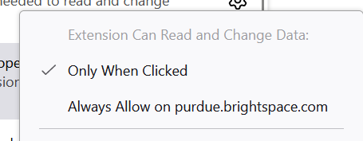

# Purdue Brightspace Campus Extension

This extension autoselects your campus when the Brightspace login page loads, saving you about a second every time Brightspace kicks you out (so like 8 times per day assuming you work 16 hours in total).

## FAQ

### Why does clicking on the Firefox badge lead me to the GitHub Releases page?

See [issue #2](https://github.com/ericswpark/purdue-brightspace-campus-extension/issues/2). The TL;DR is that the extension is not suitable for distribution on AMO because it targets a "limited audience".

You can install the Firefox extension by clicking on the file with the extension of `.xpi`. Updates will be installed automatically.

### On Firefox, the extension won't trigger on the login page until I click on it.

This is because of Manifest V3 rules. Right click on the extension and select the option "Always Allow on purdue.brightspace.com". Then it should work without having to click on the extension icon.

Note that this applies only to Firefox and I have no idea why they don't ask for this permission on install. (On Chrome they just grant this if the manifest declares it.)

